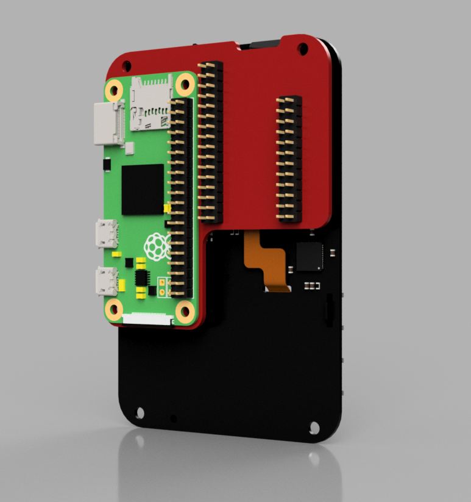

# Raspberry Pi Zero Adapter for the Keyboard FeatherWing

This adapter was designed specifically to allow driving the Keyboard FeatherWing with a Raspberry Pi Zero board.

The SW support for the adapter is very limited right now, see https://github.com/solderparty/keyboard_featherwing_sw/wiki/RPi-Zero-Adapter to learn more about the progress.